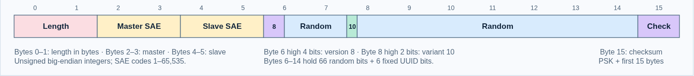
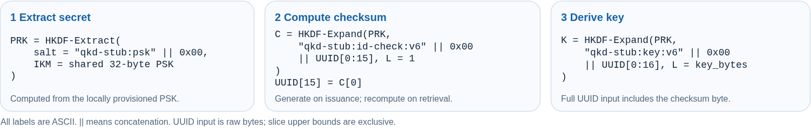

# QKD stub

**Main idea.** The stubs share only a PSK. The key ID (UUID) is a public seed that
encodes the authorized SAE pair, and the key is derived from the PSK and the whole
UUID. A certificate for the wrong SAE is rejected, and altering the SAE codes in
the UUID changes the key. Without the PSK, the key cannot be obtained.

Two independent Rust HTTPS servers simulate the ETSI GS QKD 014 V1.1.1 key
delivery API. Application A obtains a key and UUID from its local stub, sends the
UUID to application B, and B retrieves the same key from its own stub. The stubs
never contact each other and need no shared database or synchronized clock.


**PSK derivation is mandatory. Certificate-based SAE authorization is enabled by default.**
Both servers need the same 32-byte random PSK and matching numeric SAE assignments.
Each application authenticates to its local stub using a client certificate.

This is a software test stub, not real QKD. It has no key consumption, expiry,
issuance history, or forward secrecy. Anyone with the PSK can reconstruct keys
from their UUIDs. UUID metadata is public.

## Prerequisites

| Needed | For | Notes |
| --- | --- | --- |
| Rust 1.89+ (`rustc`, `cargo`) | build | Edition 2024 needs 1.85, and current dependencies need 1.89. Ubuntu's default `rustc` package is too old. |
| C compiler (`gcc`, `libc6-dev`) | build | Needed by `ring`. `make`, `pkg-config` and OpenSSL headers are **not** needed. |
| `openssl` command | `scripts/*.sh`, PSK generation | CLI only, not the library. |
| `curl`, `python3` | quickstart commands | |
| Python 3.11+ | `tests/*.py` | Uses `tomllib`. Ubuntu 22.04 has 3.10, so run only the Rust tests there. |

**Ubuntu 24.04** (also available on 22.04), minimal install from the distribution:

```sh
sudo apt-get update
sudo apt-get install -y --no-install-recommends \
    ca-certificates gcc libc6-dev curl openssl python3 rustc-1.91 cargo-1.91
export PATH=/usr/lib/rust-1.91/bin:$PATH   # add to ~/.profile to keep it
```

Any Ubuntu version can instead use [rustup](https://rustup.rs/) for Rust, after
installing the other packages above without `rustc-1.91 cargo-1.91`:

```sh
curl --proto '=https' --tlsv1.2 -sSf https://sh.rustup.rs | sh -s -- -y --profile minimal
. ~/.cargo/env
```

Development checks (`cargo fmt`, `cargo clippy`) also need `rustfmt` and `clippy`:
`rustup component add rustfmt clippy`. Ubuntu 24.04 has no versioned `clippy`
package, so use rustup for those.

`scripts/check-ubuntu.sh [IMAGE]` verifies this on a fresh container
(default `ubuntu:24.04`, requires Docker and network): it installs exactly the
apt packages above, then builds, runs the quickstart below, the Rust tests and all
three Python tests. It takes about 90 seconds and passes on Ubuntu 24.04. Ubuntu
22.04 was checked only for the rustup build and certificate generation. The build
was also confirmed with `rustc-1.89`, and fails with 1.85.

## Build and quickstart

Run from this directory:

```sh
cargo build --release --locked
./scripts/gen-certs.sh pki localhost 127.0.0.1 ::1
(umask 077; set -C; openssl rand 32 > pki/shared.psk)
./scripts/gen-client-cert.sh pki client-a
./scripts/gen-client-cert.sh pki client-b urn:qkd:sae:B
```

Generate the PSK **once**. It is exactly 32 raw bytes, not a password, hex, or
Base64. The command refuses to overwrite an existing file. The ignored `pki/`
directory holds local test secrets; keep the PSK readable only by the server
account (`chmod 600 pki/shared.psk`).

Start each server in its own terminal:

```sh
./target/release/qkd-stub --listen 127.0.0.1:8443 \
  --tls-cert pki/server.crt --tls-key pki/server.key \
  --psk-file pki/shared.psk \
  --tls-client-ca pki/ca.crt --sae-map examples/sae-map.toml \
  --kme-id KME-A --peer-kme-id KME-B

./target/release/qkd-stub --listen 127.0.0.1:8444 \
  --tls-cert pki/server.crt --tls-key pki/server.key \
  --psk-file pki/shared.psk \
  --tls-client-ca pki/ca.crt --sae-map examples/sae-map.toml \
  --kme-id KME-B --peer-kme-id KME-A
```

A requests a key for B, then B retrieves it at the other server:

```sh
curl --fail --cacert pki/ca.crt --cert pki/client-a.crt --key pki/client-a.key \
  'https://127.0.0.1:8443/api/v1/keys/B/enc_keys' > issued.json
KEY_ID=$(python3 -c 'import json; print(json.load(open("issued.json"))["keys"][0]["key_ID"])')
curl --fail --cacert pki/ca.crt --cert pki/client-b.crt --key pki/client-b.key \
  "https://127.0.0.1:8444/api/v1/keys/A/dec_keys?key_ID=$KEY_ID"
```

Stop with Ctrl-C or SIGTERM; the server allows five seconds for active connections.
Certificate scripts preserve existing files; `gen-certs.sh --force` explicitly
replaces server PKI, requiring clients to update trust if the CA changes.

### Separate machines

Securely copy the same PSK to both machines. Configure identical SAE numeric code
assignments. Each server can use its own TLS certificate and local client CA;
neither TLS private keys nor CA private keys need to be shared. Each application
trusts its local server CA and presents its own mapped client certificate.

Both servers can listen on `127.0.0.1:8443` on their respective machines. For
applications elsewhere in the LAN, bind the server to an appropriate interface
and include its actual DNS name/IP when generating the server certificate.

### Optional test-only simplification

`--no-sae-binding` disables client authentication and SAE authorization. It
conflicts with `--tls-client-ca` and `--sae-map`. New IDs use zero for both SAE
codes. Retrieval skips SAE checks, even for IDs containing nonzero codes.

The PSK is always required, including with `--no-sae-binding`. There is no
`--no-psk` option or public derivation mode. A PSK alone does not restrict API
access: keep SAE authorization enabled when clients must be restricted.

Configuration is read at startup. Missing required flags, missing/unreadable
files, or PSKs of the wrong length fail startup. There is no generated default
PSK or silent fallback. `--inspect-cert` and `--help` need no server configuration.

## UUID layout

**Breaking change:** older `QK`, `QA`, `QP`, and `QB` UUIDs are unsupported;
obtain new IDs after upgrading both servers. The new UUID carries no ASCII marker,
mode flags, PSK, or derivation-version field. The derivation labels below identify
the implementation format only; they are not stored in the UUID.



Start with 16 OS-random bytes, then overwrite the following fields. Byte offsets
are zero-based; all two-byte numbers are unsigned big-endian.

| Bytes / bits | Contents |
| --- | --- |
| 0–1 | Key length in bytes, 1–8,192 |
| 2–3 | Master SAE code |
| 4–5 | Slave SAE code |
| 6–14 | Random bits, except the UUID version and variant |
| High 4 bits of byte 6 | UUID version 8 |
| High 2 bits of byte 8 | UUID variant `10` |
| 15 | One-byte checksum |

The master and slave codes are adjacent. There are **66 random bits** per fixed
SAE pair and key length. No options are encoded in the ID. Both servers must agree
on configuration.

## Key derivation



Key derivation uses HKDF-SHA512 with this exact formula (`||` means
concatenation):

```text
PRK = HKDF-Extract(
    salt = ASCII("qkd-stub:psk") || 0x00,
    IKM = shared 32-byte PSK)

UUID[15] = HKDF-Expand(
    PRK,
    info = ASCII("qkd-stub:id-check:v6") || 0x00 || UUID[0..15],
    L = 1)[0]

key = HKDF-Expand(
    PRK,
    info = ASCII("qkd-stub:key:v6") || 0x00 || UUID[0..16],
    L = key length in bytes)
```

The slices have exclusive upper bounds: the checksum covers the first 15 bytes,
and key derivation uses all 16 bytes, including the checksum. Input is raw UUID
bytes, not the printed string. SHA-512 supports the full 8,192-byte output limit.
See [HKDF, RFC 5869](https://www.rfc-editor.org/rfc/rfc5869.html).

On retrieval, the server validates length, UUID version/variant, and checksum.
SAE authorization then checks the URL's master SAE and the certificate's slave SAE
against the two embedded codes. Invalid checksums return HTTP 400 with no keys;
wrong SAE identities return HTTP 401. A batch fails entirely if any ID fails.

The checksum is a **configuration/error check, not a security boundary**. A wrong
PSK passes with probability 1/256 for an individual ID; in that case the server
returns a different key. Tampering can also pass an 8-bit check. Do not treat the
checksum as authentication or proof of issuance. It changes with each UUID rather
than exposing a fixed fingerprint of the PSK.

Repeat retrieval and restarts reproduce the same keys. Changing the PSK changes
the keys and usually invalidates existing checksums. Keep the original secret
when existing IDs must remain usable. There is no replay detection or proof that
another stub issued an ID. Colliding IDs reproduce the same key. Compromising the
PSK exposes past keys for known IDs.

## Certificate-based SAE authorization

Supply `--tls-client-ca` and `--sae-map` on both simulators (required by default).
It supports multiple SAE pairs on the same two processes. A client must present a
certificate signed by a trusted client CA, valid for client authentication. Its
subject DN or a supported SAN is matched against the configured SAE registry.
Missing, untrusted, expired, or wrong-purpose certificates fail the TLS handshake;
valid certificates with no mapping or conflicting SAE mappings receive HTTP 401.

The example registry is in [`examples/sae-map.toml`](examples/sae-map.toml):

```toml
[[sae]]
id = "A"
code = 1
identities = [{ subject_dn = "CN=client-a" }]

[[sae]]
id = "B"
code = 2
identities = [{ san_uri = "urn:qkd:sae:B" }]
```

Each `[[sae]]` entry has `id`, `code`, and optional `identities`. Each identity is
an inline table with exactly one selector field (see below). Use TOML literal
strings (`'...'`) for DNs containing backslashes. Unknown keys are rejected.

Both simulators must assign the **same unique numeric code to each SAE ID**.
Codes are integers from 1 to 65,535. Keep assignments stable while any key IDs may
still be used: changing a code changes the meaning of existing IDs. Both endpoints
need registry entries for all participating SAEs, but their certificate selectors
and trusted client CAs may differ. Remote-only entries may omit `identities`.
The file is read at startup; restart after changes.

Any mapped SAE can request a key for any registered SAE. On `enc_keys`, the master
is the certificate's SAE and the slave is the SAE in the URL. Both codes are
embedded in the returned UUID. On `dec_keys`, the caller must match that UUID's
slave code, and the URL's master SAE must match its master code. The entire batch
is rejected with 401 if any ID belongs to another pair. This also prevents the
master from retrieving its own issued key through `dec_keys`, unless master and
slave are explicitly the same SAE. `Request-SAE-ID` cannot impersonate another SAE.
There is no additional pair allowlist.

### Certificate mapping rules

Use the built-in inspector to obtain exact selector values from an existing
certificate; it prints metadata only, does not verify trust, and its output is an
`identities = [...]` line to paste into an `[[sae]]` entry:

```sh
./target/release/qkd-stub --inspect-cert path/to/client.crt
```

Supported selector fields are `subject_dn`, `san_dns`, `san_uri`, `san_email`, and
`san_ip`. DN, URI, and email matching is exact and case-sensitive. DNS matching is
ASCII case-insensitive; IP addresses are normalized. There are no wildcard,
substring, or regex matches. DN values use a deterministic RFC4514-style rendering
with escaped attribute values; use inspector output rather than hand-translating
another tool's DN formatting. Unsupported non-UTF8 DN attributes require a SAN
selector. Other SAN types are ignored.

Multiple selectors are alternatives. A certificate may match several selectors
for the same SAE, but matching different SAEs is an error; there is no DN/SAN
precedence. Duplicate IDs, numeric codes, selectors, and invalid configuration
fields are rejected at startup. Client certificate renewal works without changing
key IDs when the replacement certificate maps to the same SAE code.

## Command-line interface

```text
--listen ADDRESS       Default: 127.0.0.1:8443 (numeric IP:port)
--tls-cert FILE        Required server PEM certificate/chain
--tls-key FILE         Required unencrypted server PEM private key
--psk-file FILE        Required: exactly 32 raw bytes
--tls-client-ca FILE   Required unless --no-sae-binding: client CA PEM bundle
--sae-map FILE         Required unless --no-sae-binding: SAE registry TOML
--no-sae-binding       Explicitly disable client authentication/SAE checks
--sae-id ID            Unrestricted-mode status fallback; default sae-local
--kme-id ID            Default: kme-local
--peer-kme-id ID       Default: kme-peer
--inspect-cert FILE   Print client certificate selectors and exit
--help / --version
```

HTTPS supports TLS 1.2 and 1.3. There is no HTTP listener. The routes and JSON
formats follow ETSI GS QKD 014 V1.1.1 for integration testing; the stub is not
fully ETSI-compliant.

## API

All paths begin with `/api/v1/keys/{SAE_ID}`. URL-encode SAE identifiers.
With `--no-sae-binding`, no client certificate is required. By default, all three APIs require a verified, unambiguously mapped client certificate;
SAE IDs in the URL must be present in the registry.

| Method | Suffix | Parameters |
| --- | --- | --- |
| GET | `/status` | Peer slave SAE in the path; master from certificate in SAE mode, otherwise optional `Request-SAE-ID` header |
| GET | `/enc_keys` | Optional `number` and `size` query parameters |
| POST | `/enc_keys` | JSON object with optional `number`, `size`, extension fields |
| GET | `/dec_keys` | Required `key_ID` query parameter |
| POST | `/dec_keys` | JSON `{"key_IDs":[{"key_ID":"UUID"}, ...]}` |

`number` defaults to 1 and must be 1–128. `size` defaults to 256 bits and must be
8–65,536 bits, divisible by 8. A POST issuance request with defaults uses `{}`.
Retrieval accepts 1–128 IDs, preserving order and duplicates. The UUID carries the
key length; `dec_keys` needs no size parameter or prior issuance on that endpoint.
Key values use standard padded Base64. IDs are returned in lowercase hyphenated
UUID format; retrieval also accepts uppercase hyphenated UUIDs.

The following examples assume `--no-sae-binding` with the shared PSK configured. For default mode,
use the certificate-authenticated calls in the quickstart above.

```sh
curl --cacert pki/ca.crt 'https://127.0.0.1:8443/api/v1/keys/B/status'
curl --cacert pki/ca.crt 'https://127.0.0.1:8443/api/v1/keys/B/enc_keys?number=2&size=256'
curl --cacert pki/ca.crt -H 'Content-Type: application/json' \
  -d '{"number":2,"size":512}' 'https://127.0.0.1:8443/api/v1/keys/B/enc_keys'
curl --cacert pki/ca.crt \
  "https://127.0.0.1:8444/api/v1/keys/A/dec_keys?key_ID=$KEY_ID"
```

A key response has this shape (this test vector uses 32 bytes of `0x07` as
the PSK; deployment secrets must be randomly generated):

```json
{"keys":[{"key_ID":"00200000-0000-8678-9abc-def012345679","key":"nVsQbynRkkSHxR590PcH9EjAZfPx6vgYbS2iigrJgLE="}]}
```

Status returns all required ETSI fields. `stored_key_count` and `max_key_count`
are fixed at 1,024: a synthetic, non-depleting availability indicator, not a real
pool or lifetime issuance limit. `max_key_per_request` is 128, `key_size` is 256,
`min_key_size` is 8, `max_key_size` is 65,536, and `max_SAE_ID_count` is 0.
`master_SAE_ID` comes from the client certificate in SAE mode; `Request-SAE-ID`
and `--sae-id` cannot override it. With `--no-sae-binding` it comes from `Request-SAE-ID`
if supplied, otherwise `--sae-id`.

Nonempty `additional_slave_SAE_IDs` is rejected because multicast is not
advertised. Optional extension objects are ignored. Nonempty mandatory extensions
are rejected with `not all extension_mandatory parameters are supported`.
Malformed requests return HTTP 400 and `{"message":"..."}`; non-byte-aligned sizes
use `size shall be a multiple of 8`. Unsupported key formats use
`one or more keys specified are not found on KME`. No partial key batch is returned
on error. Responses carry `Cache-Control: no-store`. JSON bodies are limited to 64 KiB (HTTP 413); issuance failures return
503. Unknown routes and unsupported methods return JSON 404/405 errors.

## Validation

```sh
cargo fmt --check
cargo clippy --locked --all-targets -- -D warnings
cargo test --locked
cargo build --locked
python3 tests/https.py
python3 tests/mtls.py
python3 tests/psk.py
```

The Rust tests cover the API, UUID validation, independent fixed vectors, SAE
authorization, and mandatory PSK configuration and the explicit SAE opt-out. HTTPS tests
check transport, both directions, restarts, certificate mappings and invalid
clients. PSK tests independently implement HKDF to verify the checksum and keys,
both methods, the full key-size range, both authorization settings, damaged IDs,
atomic batch rejection, wrong PSKs, and restart recovery.

`scripts/smoke-test.sh CA_CERT A_URL B_URL` tests servers started with
`--no-sae-binding`; they must use the same PSK. `QKD_STUB_BIN` selects
an alternate binary for the Python tests.
