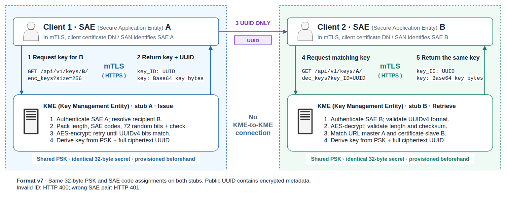

# QKD endpoint simulator for integration testing

[](https://github.com/LUMII-Syslab/qkd-stub/actions/workflows/ubuntu.yml)
[](https://github.com/LUMII-Syslab/qkd-stub/actions/workflows/windows.yml)

Two independent HTTPS endpoints simulate the ETSI GS QKD 014 V1.1.1 key delivery
API without QKD hardware.

**Main idea.** Give both stubs the same pre-shared key (PSK). Each key ID is a
UUID that encrypts the authorized SAE pair, a random seed, the key length, and a
checksum. Both stubs derive the same key from the PSK and the full UUID, without
communicating with each other or storing a shared key pool. Without the PSK,
the UUID reveals neither the embedded SAE pair nor the key.

With SAE binding enabled (the default), retrieval requires a client certificate
mapped to the UUID's receiving SAE, and the request must name its sending SAE.
An attacker holding a valid certificate for a different SAE cannot retrieve the
key through the stub using that UUID. The UUID alone is insufficient to calculate
the key without the PSK.

Two independent Rust HTTPS servers simulate the ETSI GS QKD 014 V1.1.1 key
delivery API. Application A obtains a key and UUID from its local stub, sends the
UUID to application B, and B retrieves the same key from its own stub. The stubs
never contact each other and need no shared database or synchronized clock.



Both servers use the same 32-byte pre-shared key (PSK) to independently derive
identical key material from a UUID. By default, client certificates identify each
application as a Secure Application Entity (SAE), and the UUID binds the key to
the sending and receiving SAEs. Both servers must assign the same numeric codes
to those SAEs.

The PSK is mandatory and client-certificate SAE authorization is on by default.
Anyone with the PSK can reconstruct keys and decrypt their UUID metadata. This is a software test stub, not real QKD: no key consumption, expiry,
issuance history or forward secrecy.

## Prerequisites

Native Windows setup and `.bat` scripts: [Windows quickstart](docs/windows.md).
GitHub Actions runs the full test suite on Windows and Linux.

On Linux: Rust 1.89+, a C compiler, OpenSSL 3, Python 3.11+, and curl for the
examples below. On Ubuntu 24.04 (verified on a fresh container):

```sh
sudo apt-get update
sudo apt-get install -y --no-install-recommends \
    ca-certificates gcc libc6-dev curl openssl python3 rustc-1.91 cargo-1.91
export PATH=/usr/lib/rust-1.91/bin:$PATH
```

Other versions, rustup and the version notes: [Ubuntu prerequisites](https://github.com/LUMII-Syslab/qkd-stub/wiki/Ubuntu-Prerequisites).

## Build and quickstart

Run from this directory:

```sh
cargo build --release --locked
./scripts/gen-certs.sh pki localhost 127.0.0.1 ::1
./scripts/gen-psk.sh pki/shared.psk
./scripts/gen-client-cert.sh pki client-a
./scripts/gen-client-cert.sh pki client-b urn:qkd:sae:B
```

Generate the PSK **once**: exactly 32 raw bytes, not a password, hex or Base64.
The command refuses to overwrite an existing file. Keep `pki/shared.psk` readable
only by the server account (`chmod 600`).

Start each server in its own terminal:

```sh
./target/release/qkd-stub --listen 127.0.0.1:8443 \
  --tls-cert pki/server.crt --tls-key pki/server.key \
  --psk-file pki/shared.psk \
  --tls-client-ca pki/ca.crt --sae-map examples/sae-map.toml \
  --kme-id KME-A --peer-kme-id KME-B

./target/release/qkd-stub --listen 127.0.0.1:8444 \
  --tls-cert pki/server.crt --tls-key pki/server.key \
  --psk-file pki/shared.psk \
  --tls-client-ca pki/ca.crt --sae-map examples/sae-map.toml \
  --kme-id KME-B --peer-kme-id KME-A
```

A requests a key for B, then B retrieves it at the other server:

```sh
curl --fail --cacert pki/ca.crt --cert pki/client-a.crt --key pki/client-a.key \
  'https://127.0.0.1:8443/api/v1/keys/B/enc_keys' > issued.json
KEY_ID=$(python3 -c 'import json; print(json.load(open("issued.json"))["keys"][0]["key_ID"])')
curl --fail --cacert pki/ca.crt --cert pki/client-b.crt --key pki/client-b.key \
  "https://127.0.0.1:8444/api/v1/keys/A/dec_keys?key_ID=$KEY_ID"
```

Stop with Ctrl-C or SIGTERM. `gen-certs.sh --force` replaces existing server PKI.

### Separate machines and unrestricted mode

Copy the same PSK and the same SAE code assignments to both machines. Each server
may use its own TLS certificate and client CA. `--no-sae-binding` disables client
authentication and SAE checks (test only); the PSK is still required. Details:
[Deployment notes](https://github.com/LUMII-Syslab/qkd-stub/wiki/Deployment-Notes).

## Key IDs and derivation

Key IDs are AES-256 ciphertext formatted with UUIDv4 version/variant bits.
The encrypted payload holds the key length, SAE pair, 72 random bits and a
one-byte checksum. Generation retries with fresh randomness until the ciphertext
itself has the required six bits (64 attempts on average); no ciphertext bits
are overwritten. This retains approximately 66 bits of randomness per fixed
SAE pair and key length. Retrieval needs one decryption.

The PSK hides the embedded pair and length from observers of the ID. It does not
hide network endpoints or traffic patterns, authenticate issuance, or prevent
replay. The checksum remains an 8-bit configuration/error check, not a security
boundary. See [encrypted ID format](docs/encrypted-key-ids.md) for the exact layout,
derivation and limits. Older layout/derivation images describe the previous format.

## Certificate-based SAE authorization

Both servers need `--tls-client-ca` and `--sae-map`. A client must present a
certificate signed by that CA. Its subject DN or a SAN is matched against the
registry. Invalid certificates fail the TLS handshake; unmapped or ambiguous ones
get HTTP 401.

The example registry is in [`examples/sae-map.toml`](examples/sae-map.toml):

```toml
[[sae]]
id = "A"
code = 1
identities = [{ subject_dn = "CN=client-a" }]

[[sae]]
id = "B"
code = 2
identities = [{ san_uri = "urn:qkd:sae:B" }]
```

Each identity is a table with exactly one selector (`subject_dn`, `san_dns`,
`san_uri`, `san_email` or `san_ip`). Both servers must assign the **same unique
code (1–65535) to each SAE ID**, and the codes must stay stable while any key ID
may still be used. Remote-only entries may omit `identities`. The file is read at
startup.

On `enc_keys`, the master is the certificate's SAE and the slave is the SAE in the
URL; both codes go into the UUID. On `dec_keys`, the certificate's SAE must be the
UUID's slave and the URL's SAE its master, otherwise HTTP 401 for the whole batch.
`Request-SAE-ID` cannot impersonate another SAE. Details:
[SAE authorization details](https://github.com/LUMII-Syslab/qkd-stub/wiki/SAE-Authorization).

To get exact selector values from a client certificate (metadata only, trust is
not verified), paste the output into an `[[sae]]` entry:

```sh
./target/release/qkd-stub --inspect-cert path/to/client.crt
```

## Command-line interface

```text
--listen ADDRESS       Default: 127.0.0.1:8443 (numeric IP:port)
--tls-cert FILE        Required server PEM certificate/chain
--tls-key FILE         Required unencrypted server PEM private key
--psk-file FILE        Required: exactly 32 raw bytes
--tls-client-ca FILE   Required unless --no-sae-binding: client CA PEM bundle
--sae-map FILE         Required unless --no-sae-binding: SAE registry TOML
--no-sae-binding       Explicitly disable client authentication/SAE checks
--sae-id ID            Unrestricted-mode status fallback; default sae-local
--kme-id ID            Default: kme-local
--peer-kme-id ID       Default: kme-peer
--inspect-cert FILE   Print client certificate selectors and exit
--help / --version
```

HTTPS only (TLS 1.2 and 1.3). Routes and JSON follow ETSI GS QKD 014 V1.1.1 but
the stub is not fully compliant.

## API

All paths begin with `/api/v1/keys/{SAE_ID}`. By default, all calls require a
mapped client certificate and SAE IDs in the URL must be in the registry.

| Method | Suffix | Parameters |
| --- | --- | --- |
| GET | `/status` | Peer slave SAE in the path; master from certificate in SAE mode, otherwise optional `Request-SAE-ID` header |
| GET | `/enc_keys` | Optional `number` and `size` query parameters |
| POST | `/enc_keys` | JSON object with optional `number`, `size`, extension fields |
| GET | `/dec_keys` | Required `key_ID` query parameter |
| POST | `/dec_keys` | JSON `{"key_IDs":[{"key_ID":"UUID"}, ...]}` |

Examples with `--no-sae-binding` (default mode: see the quickstart):

```sh
curl --cacert pki/ca.crt 'https://127.0.0.1:8443/api/v1/keys/B/status'
curl --cacert pki/ca.crt 'https://127.0.0.1:8443/api/v1/keys/B/enc_keys?number=2&size=256'
curl --cacert pki/ca.crt -H 'Content-Type: application/json' \
  -d '{"number":2,"size":512}' 'https://127.0.0.1:8443/api/v1/keys/B/enc_keys'
curl --cacert pki/ca.crt \
  "https://127.0.0.1:8444/api/v1/keys/A/dec_keys?key_ID=$KEY_ID"
```

Parameters, defaults, response format, errors and limits:
[API details](https://github.com/LUMII-Syslab/qkd-stub/wiki/API-Details).

## More

[Wiki](https://github.com/LUMII-Syslab/qkd-stub/wiki/Home): key derivation, SAE authorization rules, deployment notes, testing.
